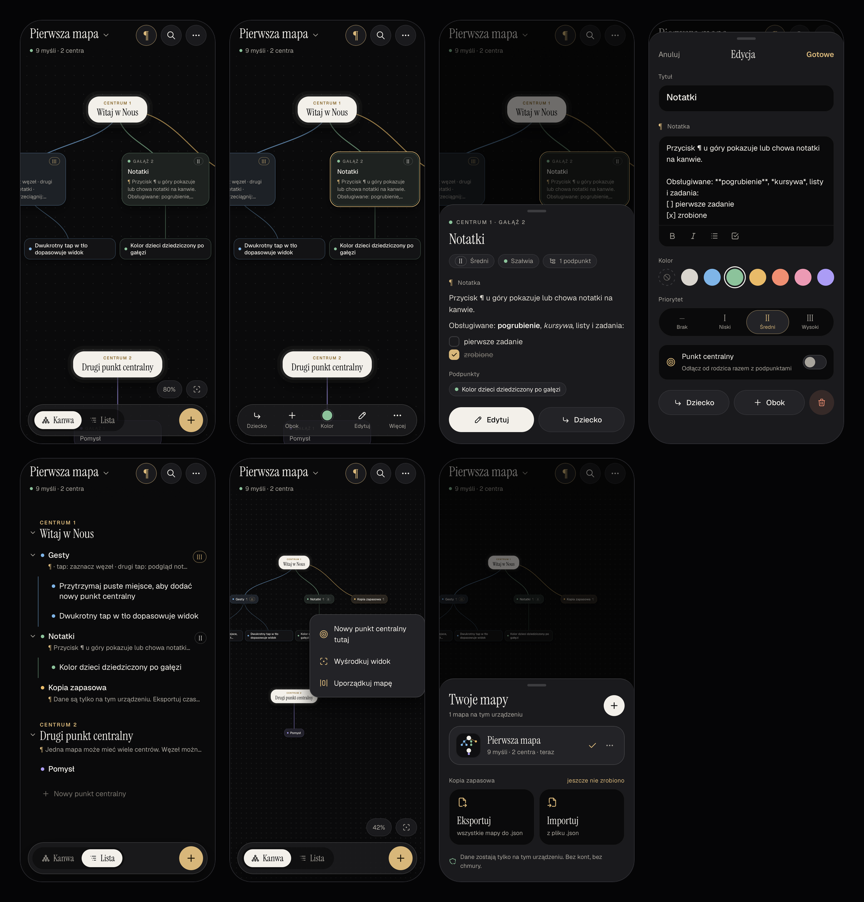

# Nous — mapa myśli na iPhone'a

Prywatna aplikacja do map myśli działająca w 100% lokalnie. Nie ma kont, serwera ani chmury: wszystkie mapy są zapisywane w pamięci urządzenia (IndexedDB). Aplikacja to PWA, czyli strona, którą dodajesz do ekranu głównego iPhone'a. Działa wtedy jak zwykła aplikacja, na pełnym ekranie i offline.



## Funkcje

- **Kanwa**: nieskończona płaszczyzna z przesuwaniem, przybliżaniem dwoma palcami i przeciąganiem węzłów razem z gałęzią.
- **Lista**: zwijany outliner z wcięciami. Przytrzymaj wiersz, aby zmienić kolejność; przesunięcie w bok zmienia wcięcie.
- **Kilka punktów centralnych** w jednej mapie. Każdy węzeł można odłączyć jako nowe centrum.
- **Notatki** pod każdą myślą: **pogrubienie**, *kursywa*, listy i zadania do odhaczania. Przycisk ¶ pokazuje lub chowa notatki na kanwie.
- **Kolor gałęzi** (dzieci go dziedziczą) i **priorytet** I / II / III.
- **Wiele map**, wyszukiwarka, cofanie i ponawianie, „Uporządkuj mapę”.
- **Kopia zapasowa**: eksport i import wszystkich map do pliku `.json`.

## Gesty

| Gest | Działanie |
|---|---|
| Tap na węzeł | zaznaczenie i pasek akcji (Dziecko, Obok, Kolor, Edytuj, Więcej) |
| Drugi tap na zaznaczony węzeł | podgląd notatki |
| Przytrzymaj węzeł i przeciągnij | przesunięcie gałęzi |
| Przytrzymaj puste miejsce | menu „Nowy punkt centralny tutaj” |
| Jeden palec na tle | przesuwanie kanwy |
| Dwa palce | przybliżanie i oddalanie (poniżej 60% węzły stają się kompaktowe) |
| Dwukrotny tap w tło | dopasowanie widoku do całej mapy |
| Lista: przytrzymaj wiersz i przeciągnij | zmiana kolejności; przesunięcie w prawo lub w lewo zmienia wcięcie |

## Uruchomienie na komputerze

Potrzebny jest Node.js 20 lub nowszy.

```bash
npm install
```

```bash
npm run dev
```

Aplikacja działa pod adresem http://localhost:5173.

## Uruchomienie na iPhonie

### Sposób A: szybki test w domowej sieci Wi-Fi

1. Mac i iPhone muszą być w tej samej sieci Wi-Fi.
2. Na Macu uruchom:
   ```bash
   npm run dev -- --host
   ```
3. Sprawdź adres IP Maca:
   ```bash
   ipconfig getifaddr en0
   ```
4. Na iPhonie otwórz w Safari `http://<IP-Maca>:5173`, np. `http://192.168.0.106:5173`.

Tak uruchomiona aplikacja działa tylko, gdy Mac jest włączony. Przez zwykłe `http` nie działa też tryb offline. To dobra droga do testów, nie do codziennego używania.

### Twoja wersja na stałe

Aplikacja jest opublikowana pod adresem **https://stan719.github.io/nous/**. Kod leży w repozytorium https://github.com/stan719/nous.

Na iPhonie:
1. Otwórz adres w **Safari**. Musi to być Safari, nie Chrome; tylko Safari dodaje aplikacje do ekranu początkowego z trybem offline.
2. Stuknij **Udostępnij** (kwadrat ze strzałką), przewiń w dół i wybierz **Do ekranu początkowego → Dodaj**.
3. Uruchamiaj Nous z nowej ikony. Działa na pełnym ekranie i bez internetu.

Aktualizacje: każdy `git push` na gałąź `main` sam uruchamia testy i publikuje nową wersję (zakładka Actions w repozytorium). Aplikacja na iPhonie pobierze ją przy następnym uruchomieniu z internetem; Twoje mapy zostają nietknięte.

### Sposób B: na stałe, za darmo, z trybem offline (opis ogólny)

Pliki aplikacji muszą być raz dostarczone przez HTTPS. Najprościej przez darmowe **GitHub Pages**. Serwer hostuje wtedy tylko kod aplikacji, a Twoje mapy nigdy nie opuszczają iPhone'a.

1. Załóż na GitHubie **publiczne** repozytorium, np. `nous`. Darmowe Pages wymagają publicznego repo; publiczny jest tylko kod, nie Twoje dane.
2. Zapisz projekt w gicie i wypchnij go na gałąź `main`:
   ```bash
   git add -A && git commit -m "Nous: pierwsza wersja"
   ```
   ```bash
   git branch -M main
   ```
   ```bash
   git remote add origin https://github.com/<twoj-login>/nous.git
   ```
   ```bash
   git push -u origin main
   ```
3. W repozytorium wejdź w **Settings → Pages → Build and deployment → Source: GitHub Actions**. Workflow `.github/workflows/deploy.yml` sam uruchomi testy, zbuduje i opublikuje aplikację.
4. Po kilku minutach aplikacja będzie pod adresem `https://<twoj-login>.github.io/nous/`.
5. Na iPhonie otwórz ten adres w **Safari**, stuknij **Udostępnij → Do ekranu początkowego**.
6. Uruchamiaj Nous z ikony na ekranie głównym. Działa na pełnym ekranie, także bez internetu.

Inne darmowe hostingi statyczne (Cloudflare Pages, Netlify) też zadziałają. Wystarczy wgrać folder `dist/` z polecenia `npm run build`.

## Twoje dane i kopia zapasowa

- Mapy są zapisywane automatycznie w IndexedDB, tylko na tym urządzeniu.
- Aplikacje dodane do ekranu głównego nie podlegają 7-dniowemu czyszczeniu danych Safari. Usunięcie ikony z ekranu głównego usuwa jednak również dane.
- Rób czasem kopię: **tytuł mapy → Twoje mapy → Eksportuj**. Na iPhonie otworzy się arkusz udostępniania; wybierz **Zachowaj w Plikach**.
- **Importuj** wczytuje plik `.json`. „Dodaj do moich” dołącza mapy obok istniejących, a „Zastąp wszystko” przywraca stan z kopii.
- Dane są przypisane do adresu, z którego otwierasz aplikację. Przenosząc się z wersji testowej (sposób A) na stałą (sposób B), przenieś mapy przez eksport i import.

## Testy

Testy jednostkowe (logika grafu, układ węzłów, kopia zapasowa, notatki, lista):

```bash
npm test
```

Testy e2e w silniku WebKit, tym samym co Safari, z profilem iPhone'a 15:

```bash
npx playwright install webkit
```

```bash
npm run e2e
```

Zrzuty ekranu do `design/screens/` (wymaga działającego `npx vite --port 5174`):

```bash
node scripts/screenshots.mjs
```

## Struktura

```
src/model/        logika grafu (czyste funkcje): drzewo, układ, kopia (zod), notatki, liczebniki
src/store/        stan aplikacji: Zustand + zapis w IndexedDB + cofanie (zundo), mapa powitalna
src/views/canvas/ kanwa: gesty, węzły, krawędzie
src/views/list/   lista: spłaszczanie drzewa, przeciąganie (dnd-kit)
src/sheets/       arkusze: podgląd, edycja, mapy, wyszukiwarka
src/components/   pasek górny, dock, kolory, priorytet, notatka, toast
src/lib/          eksport/import, obsługa iOS (klawiatura, gesty Safari)
tests/            testy jednostkowe (Vitest) i e2e (Playwright WebKit)
design/           makiety i zrzuty ekranu
```
